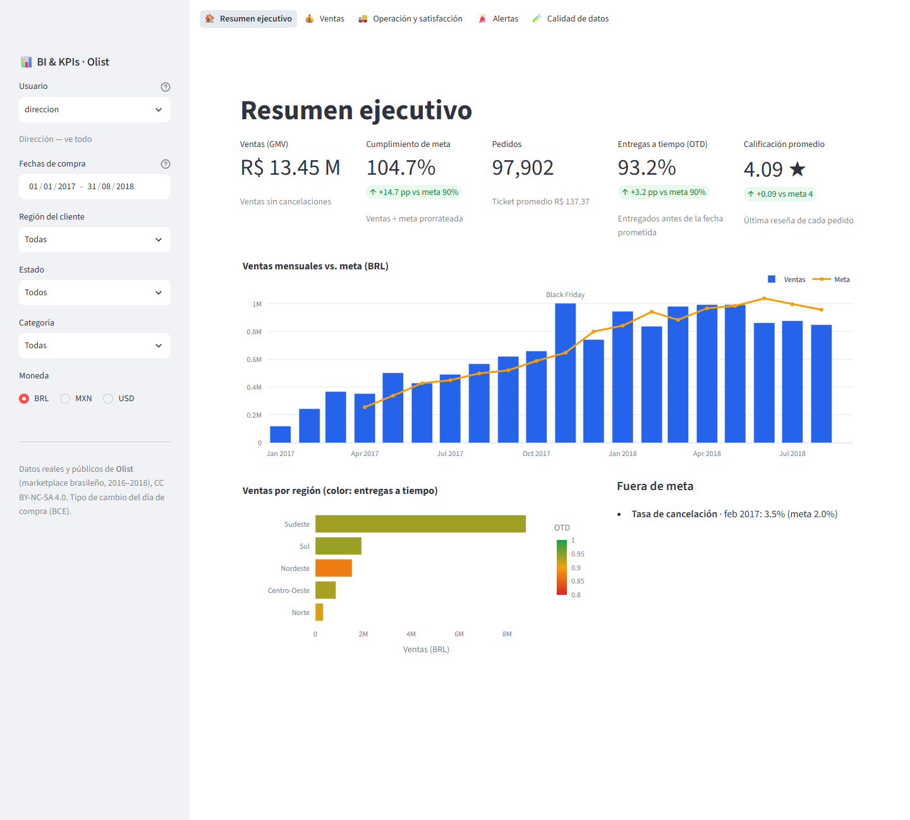
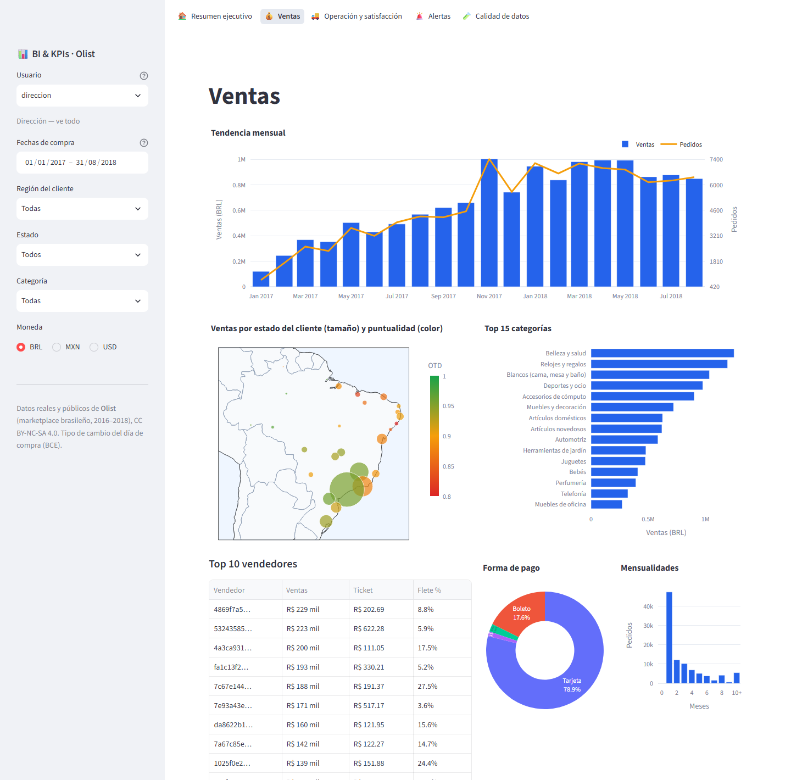
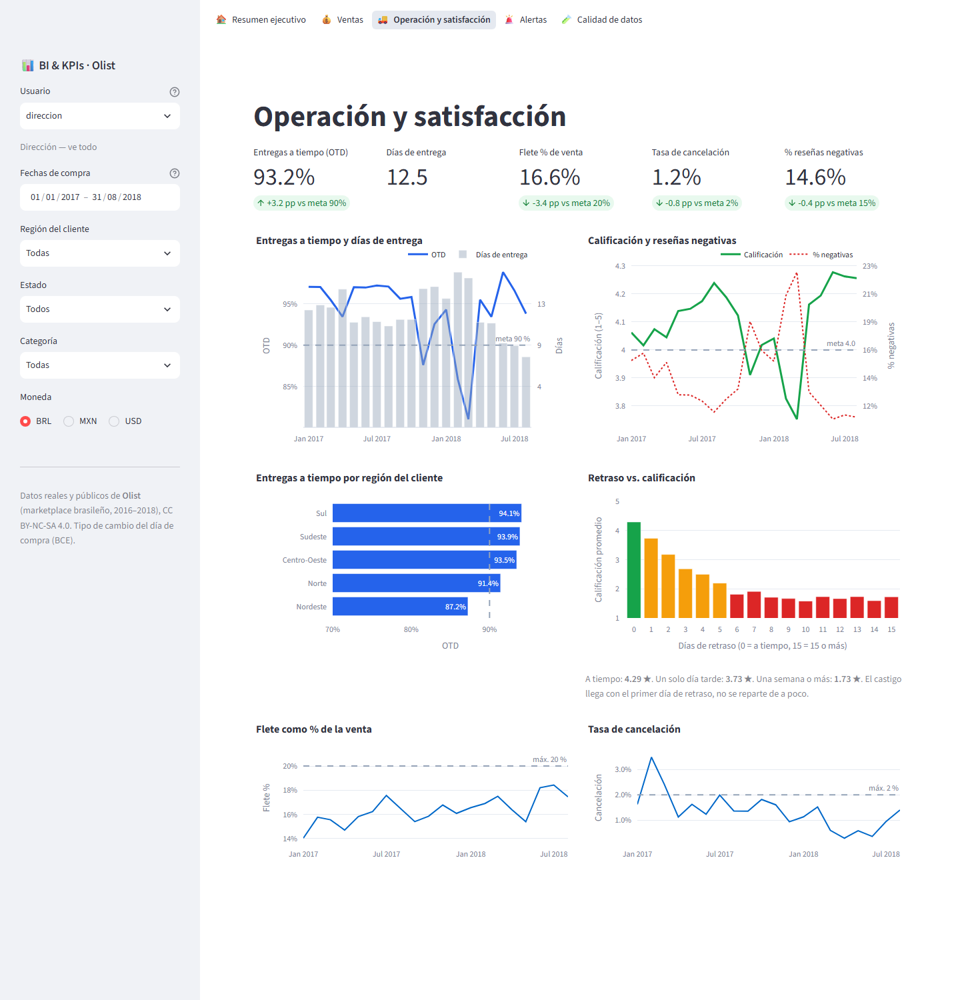
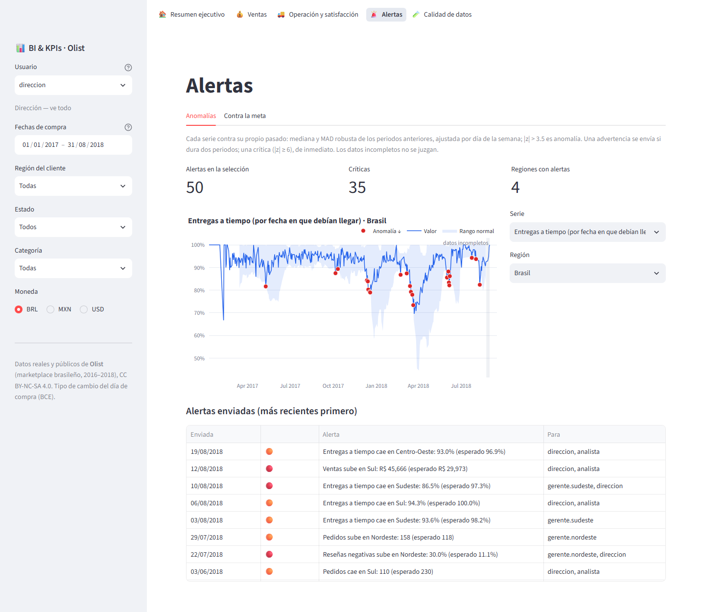
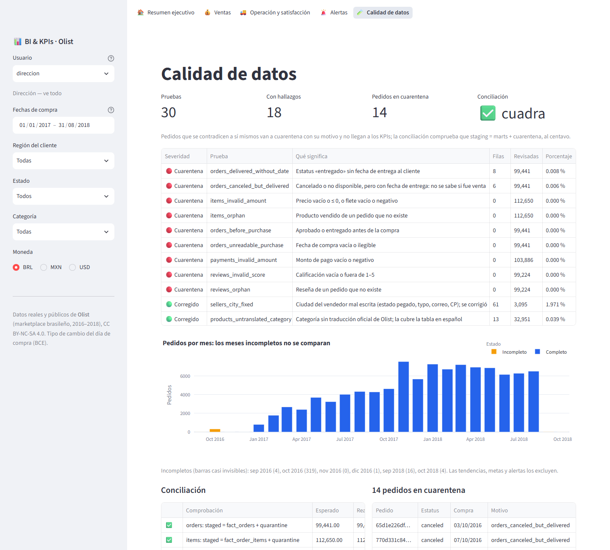
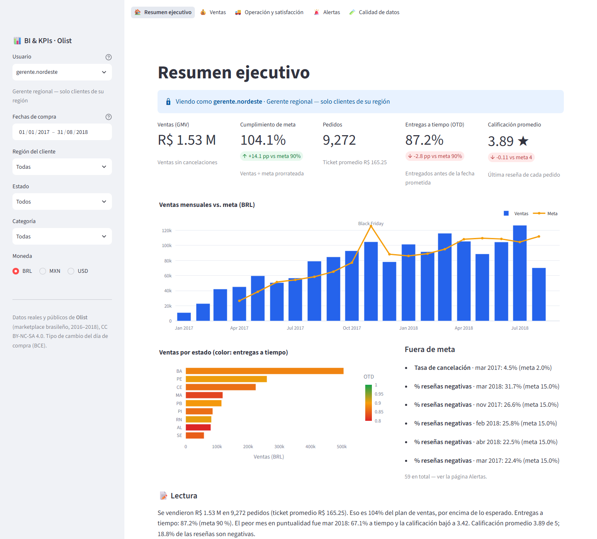

# 01 · BI & KPI Analytics — Olist e-commerce

[](https://github.com/nitoramber-svg/Portfolio-automations-of-Software/actions/workflows/bi-kpi-analytics.yml)

> 🚧 **Work in progress** — steps 1–5 of 6 done (sources → staging → quality → star schema → KPIs and row-level security → dashboard → anomaly alerts). See the [design](docs/design.md).

An end-to-end Business Intelligence pipeline built on **real, public data from Olist**, a Brazilian
e-commerce marketplace (~100k orders, 2016–2018). It targets the day-to-day of a BI / Data Analyst role:
connect several sources, clean and model the data, define KPIs, build dashboards, and alert on anomalies.

*Pipeline de BI de punta a punta sobre datos reales y públicos de Olist. Diseñado a partir de una vacante
real de Analista de BI (Amazon Quick Suite, SQL, AWS). Ver el [diseño](docs/design.md) (en español).*

## What works today

| Area | Status |
|---|---|
| 3 source types: SQL database (SQLite as the transactional system, incremental extract), flat files (CSV), HTTP API (FX rates, with cache and fallback) | ✅ |
| Staging layer: typing, de-duplication, city normalization, category translation to Spanish | ✅ |
| Star schema: 6 dimensions, 3 fact tables, daily aggregate, BRL → MXN/USD conversion | ✅ |
| Tests on a hand-made fixture with known answers + CI | ✅ |
| Data quality: 30 checks, quarantine of self-contradicting rows, report, and a reconciliation that refuses to publish marts that lost data — [what the real data showed](docs/data-quality.md) | ✅ |
| KPI engine: 13 KPIs declared in YAML, any cut (date, region, state, category, seller, payment), BRL / MXN / USD; sales plan prorated by day | ✅ |
| Row-level security in the query layer: region managers, an analyst without customer-level data, sellers who see only their own lines of shared orders — [details and real numbers](docs/kpis.md) | ✅ |
| Dashboard (Streamlit, Spanish): executive summary with a plain-language reading, sales, operations & satisfaction, target alerts, data quality — every chart goes through row-level security | ✅ |
| Anomaly detection (robust z: median + MAD, weekday-adjusted), alerts routed like row-level security, e-mail / Slack with a demo outbox, `bi run-daily` and `bi replay` — finds Black Friday and the 2018 truckers' strike, ignores the end of the data, ~0.24 unexplained alerts per KPI per month — [details](docs/alerts.md) | ✅ |
| Event calendar, early warning, playbooks, impact analysis | ⏳ step 5b |

## Dashboard

Real Olist data, January 2017 – August 2018. Screenshots are regenerated with `python scripts/screenshots.py`.

| Executive summary | Sales |
|---|---|
|  |  |
| **Operations & satisfaction** | **Target alerts** |
|  |  |
| **Data quality** | **Same page, as the Nordeste regional manager** |
|  |  |

What the dashboard surfaces on the real data:

- **One day late costs most of the rating.** Orders delivered on time average 4.29★; one day late, 3.73★;
  a week or more, 1.73★. The penalty is a cliff, not a slope.
- **February–March 2018 broke delivery.** National on-time delivery fell to 81–86 % and the rating to 3.75;
  in the **Nordeste it hit 67 %** in March.
- **Sales fell behind plan from June 2018** (83–89 % of a run-rate plan) after beating it all spring.

*Lo que muestra el tablero con los datos reales: un solo día de retraso se lleva casi toda la calificación;
feb–mar 2018 rompió la puntualidad (67 % en el Nordeste); las ventas quedan bajo el plan desde junio de 2018.*

## Quick start

```bash
pip install -e ".[dev]"

# Option A — synthetic data in the Olist schema (no account needed)
bi sample

# Option B — the real dataset
bi download                           # needs KAGGLE_USERNAME / KAGGLE_KEY
bi download --zip path/to/archive.zip # or the ZIP downloaded from Kaggle

bi load      # extract → staging → quality → star schema  (add --offline to skip the FX API)
bi quality   # every check: rows flagged, % and value of the affected orders
bi dashboard # http://localhost:8501 — pick a user in the sidebar to see row-level security
bi replay --from 2018-05-15 --to 2018-06-15   # which alerts the strike would have raised
bi kpis --user gerente.nordeste --from 2018-01-01 --by month --currency MXN
pytest
```

## Architecture

```
SQLite (orders, payments) ─┐
CSV files (catalog, ...)  ─┼─► raw ─► stg ─► quality ─► mart (star schema) ─► KPIs ─► dashboard / alerts
FX API (BRL→MXN/USD)      ─┘                    └─► quarantine     DuckDB
```

Transformations are plain, versioned SQL in [`sql/`](sql/), run in order by the pipeline.

## Data

*Brazilian E-Commerce Public Dataset by Olist* — published on
[Kaggle](https://www.kaggle.com/datasets/olistbr/brazilian-ecommerce) under CC BY-NC-SA 4.0.
The data is not stored in this repository. `bi sample` generates **synthetic** data with the same schema
(clearly marked as such) so the project runs anywhere. This project is not affiliated with Olist.
