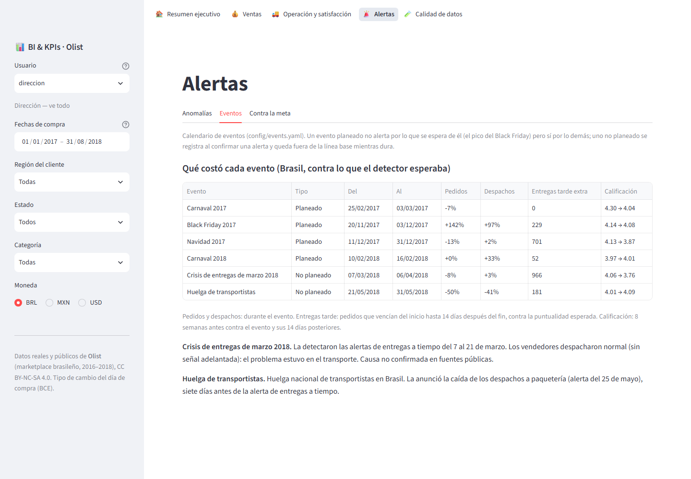
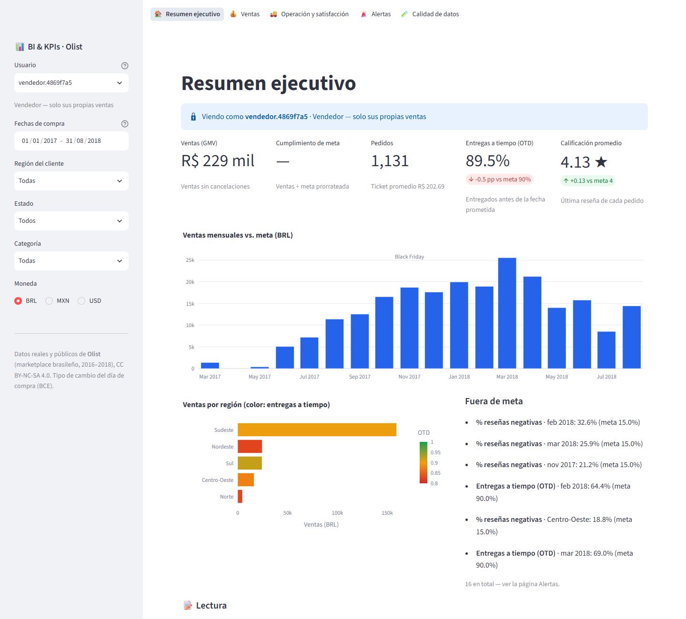

# 01 · BI & KPI Analytics — Olist e-commerce

[](https://github.com/nitoramber-svg/Portfolio-automations-of-Software/actions/workflows/bi-kpi-analytics.yml)

An end-to-end Business Intelligence system on **real, public data from Olist**, a Brazilian
e-commerce marketplace (~100k orders, 2016–2018), built from the requirements of a real BI
Analyst job posting (Amazon Quick Suite, SQL, AWS): connect several sources, clean and model the
data, define and monitor KPIs, build dashboards, secure them by role, and alert on anomalies.

*Sistema de BI de punta a punta sobre datos reales y públicos de Olist, construido a partir de
una vacante real de Analista de BI. La documentación técnica está en español: empezar por el
[diseño](docs/design.md).*

## What it found in the data

- **The May 2018 truckers' strike was flagged 7 days before deliveries failed.** Not by the
  delivery KPIs: by carrier pickups, which fell from ~400 a day to 176 when carriers stopped
  collecting. Orders halved during the strike. ([alerts](docs/alerts.md))
- **One day late costs most of the rating.** On time: 4.29★. One day late: 3.73★. A week or more:
  1.73★. A cliff, not a slope — a least-squares line (−0.016★ per day) would have hidden it.
- **The March 2018 delivery crisis hurt customers more than the strike**: 966 extra late orders
  and the rating down from 4.06 to 3.76. It had no leading signal: sellers dispatched normally.
- **Olist's data is structurally clean; its problems are logical.** Of 1,075 orders whose payment
  didn't match price + freight, 772 had no items and 249 were installment interest: 54 were
  actually unexplained. ([data quality](docs/data-quality.md))

## The posting, requirement by requirement

| The job asks for | What this project does | Where |
|---|---|---|
| Connect SQL, APIs and flat files | SQLite as the transactional system (incremental extract), Olist CSVs, a live FX API with retries, cache and fallback | `src/bi_kpi/extract` |
| Clean and structure data | Staging in plain SQL; 30 data-quality checks; self-contradicting rows quarantined with their reason; a reconciliation that **refuses to publish** if the marts lost or duplicated a cent | [data-quality.md](docs/data-quality.md) |
| Star / snowflake models, ETL/ELT | ELT raw → staging → star schema (6 dimensions, 3 facts) in DuckDB, BRL → MXN / USD at each day's rate | `sql/` |
| Define, validate and monitor KPIs | 13 KPIs declared in YAML (no code to add one), any cut, Σ/Σ ratios; a sales plan redesigned after measuring (Olist grew 8× in a year) | [kpis.md](docs/kpis.md) |
| Row-level security | Enforced in the query layer: regional managers, an analyst without customer columns, sellers who never see other sellers' lines of shared orders. Leak tests | [kpis.md](docs/kpis.md) |
| Dashboards | Streamlit, 5 pages in Spanish, a plain-language reading for non-technical readers | [user-guide.md](docs/user-guide.md) |
| Automatic alerts and anomaly analysis | Robust z (median + MAD) on series dated when each value becomes knowable; event calendar; early warning; playbooks with the orders at risk attached; one digest per person per day; `bi replay` over history | [alerts.md](docs/alerts.md) |
| Optimize queries and load speed | Every page under 1 s for every role (from 1.9 s); load and pages measured at 5× volume | [benchmark.md](docs/benchmark.md) |
| Publish to Quick Suite | `bi export`: Parquet + Athena DDL + the RLS permissions dataset; KPIs as QuickSight calculated fields | [quicksuite.md](docs/quicksuite.md) |
| Train end users | User guide with screenshots and FAQ | [user-guide.md](docs/user-guide.md) |

## Dashboard

Real Olist data, January 2017 – August 2018. Regenerate with `python scripts/screenshots.py`.

| Executive summary | Sales |
|---|---|
|  |  |
| **Operations & satisfaction** | **Anomaly alerts, with events and orders at risk** |
|  |  |
| **Data quality** | **Same page, as the Nordeste regional manager** |
|  |  |
| **What each event cost** | **As a seller: only their own sales** |
|  |  |

## Where measuring changed the design

The [design](docs/design.md) was written before touching the data. Each of these was changed
because a measurement proved it wrong, and each is documented where it happened:

- A **year-over-year sales plan** would have been beaten by 650 % (Olist grew 8× in a year) → a
  3-month run rate.
- **Deliveries by purchase date** use information a live system doesn't have yet → dated by the
  day each order was due.
- **Excluding unplanned events from the baseline for good**, as designed, made the detector miss
  the strike → excluded only while the event lasts (four rules compared on the real data).
- A 28-observation MAD gives **15× the nominal false-alarm rate** on pure noise; a longer window
  missed the strike → kept the window, added a persistence rule (0.07 alerts per series-year on
  noise).
- Seller city cleaning, quality thresholds, alert volume floors — all set after measuring.

## Quick start

```bash
pip install -e ".[dev]"

bi sample                              # synthetic data in Olist's schema, or:
bi download --zip path/to/archive.zip  # the real dataset, downloaded from Kaggle

bi load        # extract → staging → quality → star schema → plan → anomalies → alerts
bi dashboard   # http://localhost:8501 — pick a user in the sidebar to see row-level security
bi quality     # every data quality check
bi kpis --user gerente.nordeste --from 2018-01-01 --by month --currency MXN
bi replay --from 2018-05-15 --to 2018-06-15   # the alerts the strike would have raised, day by day
bi run-daily --date 2018-05-27                # one day's digests, written to outbox/
bi impact      # what each event cost
bi export      # Parquet + Athena DDL + RLS rules for Quick Suite
pytest         # 127 tests
```

## Architecture

```
SQLite (orders, payments) ─┐                     ┌─► quarantine
CSV files (catalog, ...)  ─┼─► raw ─► staging ─► quality ─► star schema ─► datasets ─► KPI engine ─► dashboard
FX API (BRL→MXN/USD)      ─┘                                    │                (row-level security)
                                                                 ├─► sales plan
              config/events.yaml ─────────────────────────────► anomaly detector ─► alerts ─► e-mail / Slack
                                                                 └─► export ─► S3 / Athena / QuickSight
```

DuckDB, Python, plain SQL in [`sql/`](sql/), Streamlit + Plotly. A load builds a new warehouse
file and publishes it only when every step succeeded.

## Tests

127 tests: unit, data quality (a fixture with one planted defect per check), integration (a
hand-made fixture where every number is known), security (leak tests, including an order shared
by two sellers), dashboard (every page × every role, including a user who sees nothing), and
acceptance on the real data (`tests/real`, skipped in CI, where the data isn't).

## Data

*Brazilian E-Commerce Public Dataset by Olist* — published on
[Kaggle](https://www.kaggle.com/datasets/olistbr/brazilian-ecommerce) under CC BY-NC-SA 4.0.
The data is not stored in this repository. `bi sample` generates **synthetic** data with the same
schema (clearly marked as such) so the project runs anywhere. This project is not affiliated with
Olist.
