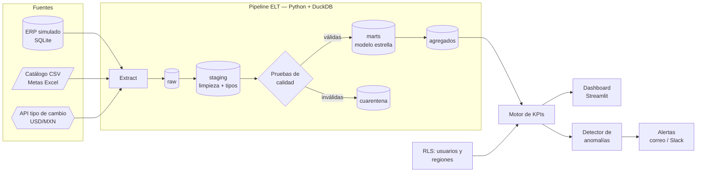
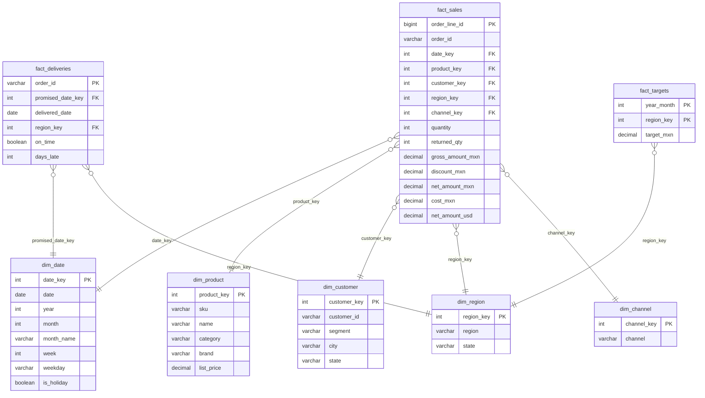

# Fase 0 — Diseño: BI & KPI Analytics

> **Estado:** borrador para aprobación. No hay código todavía.
> **Vacante de referencia:** Analista de QuickSuite (BI) — CDMX, remoto híbrido, $55k–62k MXN/mes.
> **Alcance:** 100 % local y gratuito. Guía para migrar a AWS/Amazon Quick Suite al final.

---

## 1. Objetivo

Construir un sistema de Business Intelligence de punta a punta que haga **cada responsabilidad de la vacante**:
tomar datos crudos de varias fuentes, limpiarlos, modelarlos en estrella, calcular KPIs, mostrarlos en un
dashboard interactivo, detectar anomalías y mandar alertas, todo con seguridad por rol.

### Vacante → solución

| Responsabilidad / requisito | Cómo lo cubre el proyecto | Módulo |
|---|---|---|
| Diseñar y mantener tableros y modelos analíticos | Dashboard de 5 páginas + modelo estrella | `dashboard/`, `sql/marts/` |
| Conectar SQL, nube, APIs y archivos planos | 3 fuentes reales: base SQL (ERP simulado), CSV/Excel, API de tipo de cambio | `extract/` |
| Limpiar y estructurar los datos | Capa *staging* con limpieza, tipado y deduplicación | `sql/staging/` |
| Definir, validar y monitorear KPIs | KPIs declarados en `kpis.yaml` (fórmula, meta, dirección, umbrales) | `kpis/` |
| Optimizar consultas y velocidad de carga | Tablas agregadas + benchmark documentado antes/después | `sql/marts/agg_*`, `scripts/benchmark.py` |
| Alertas automáticas y análisis de anomalías | Detección robusta (mediana + MAD) + reglas vs. meta → correo/Slack | `anomalies/`, `alerts/` |
| Integridad, precisión y gobernanza | Pruebas de calidad de datos, cuarentena de filas inválidas, linaje | `quality/` |
| Seguridad a nivel de fila (RLS) | Usuarios por rol/región; el filtro se aplica en la consulta, no solo en la UI | `security/` |
| Publicación de espacios de trabajo | Exportación de datasets + reglas RLS en formato compatible con Quick Suite | `docs/quicksuite.md` |
| Modelos estrella / copo de nieve, ETL/ELT | Patrón ELT: raw → staging → marts (estrella) | `sql/` |
| Capacitar a usuarios finales | Manual de usuario con capturas | `docs/user-guide.md` |
| Python (plus) | Todo el pipeline en Python + SQL | — |
| Comunicar hallazgos a no técnicos | Página "Resumen ejecutivo" con lectura en lenguaje natural de cada KPI | `dashboard/` |

---

## 2. Caso de negocio (empresa ficticia)

**Distribuidora Nova S.A. de C.V.** — vende productos de consumo en México.

- **4 regiones:** Norte, Centro, Occidente, Sur (32 estados asignados a cada región).
- **3 canales:** Tienda física, E-commerce, Mayoreo.
- **~300 productos** en 6 categorías (Abarrotes, Bebidas, Limpieza, Cuidado personal, Mascotas, Hogar).
- **~5,000 clientes** en 3 segmentos (Minorista, Mayorista, Corporativo).
- **24 meses de historia diaria** (~250,000 líneas de pedido).
- Metas mensuales de venta por región (el Excel que "manda dirección").

Los datos son sintéticos pero realistas: estacionalidad (diciembre alto, enero bajo), día de la semana,
crecimiento anual y ruido. Con **semilla fija**, así cualquiera obtiene exactamente los mismos números.

**Anomalías sembradas a propósito** (para demostrar que el detector funciona y probarlo):

| # | Qué pasa | Dónde | KPI que debe disparar |
|---|---|---|---|
| A1 | Caída del e-commerce 3 días (falla del sitio) | Sur, E-commerce | Ventas netas |
| A2 | Pico de devoluciones de una marca (lote defectuoso) | Nacional, Limpieza | Tasa de devolución |
| A3 | Retrasos de entrega 2 semanas (problema logístico) | Occidente | Entregas a tiempo |
| A4 | Descuento excesivo mal capturado | Centro, Mayoreo | Margen bruto % |

---

## 3. Arquitectura



**Decisiones técnicas**

| Decisión | Elección | Por qué |
|---|---|---|
| Almacén analítico | **DuckDB** (un archivo) | SQL analítico rápido, cero servidor. El mismo SQL corre en Athena/Redshift casi sin cambios |
| Fuente "SQL" | **SQLite** como ERP | Simula extraer de una base transaccional real |
| Fuente "API" | API pública de tipo de cambio (sin llave) | Demuestra integración con APIs; si no hay internet usa un respaldo local |
| Transformaciones | **SQL puro** en archivos versionados | Igual que se trabaja con dbt/Athena; fácil de revisar |
| Dashboard | **Streamlit + Plotly** | Interactivo, se corre con un comando, ideal para capturas |
| Configuración | YAML (`kpis.yaml`, `users.yaml`, `sources.yaml`) | Agregar un KPI no requiere tocar código |
| Pruebas | **pytest** + **Playwright** + GitHub Actions | Unitarias, de datos, de integración y de navegador |

---

## 4. Modelo de datos (estrella)



**Granularidad:** `fact_sales` = una línea de pedido; `fact_deliveries` = un pedido; `fact_targets` = región × mes.

**Agregados para rendimiento:** `agg_sales_daily` (día × región × canal × categoría). El dashboard lee de aquí;
el benchmark compara tiempos contra consultar `fact_sales` directo.

---

## 5. KPIs

Definidos en `config/kpis.yaml`. Cada KPI tiene: fórmula SQL, unidad, meta, dirección ("más es mejor" o "menos es mejor")
y umbrales de alerta.

| KPI | Fórmula | Meta (ejemplo) | Alerta si… |
|---|---|---|---|
| **Ventas netas** | Σ net_amount_mxn | Según Excel de metas | Anomalía estadística o < 90 % de la meta prorrateada |
| **Cumplimiento de meta** | Ventas netas ÷ meta del periodo | ≥ 100 % | < 90 % |
| **Margen bruto %** | (Ventas netas − costo) ÷ ventas netas | ≥ 28 % | < 24 % o anomalía |
| **Ticket promedio** | Ventas netas ÷ # pedidos | — | Anomalía |
| **Pedidos** | # pedidos distintos | — | Anomalía |
| **Clientes activos** | # clientes con compra en el periodo | — | Caída > 15 % vs. periodo anterior |
| **Entregas a tiempo (OTD)** | Pedidos a tiempo ÷ pedidos entregados | ≥ 95 % | < 90 % |
| **Tasa de devolución** | Unidades devueltas ÷ unidades vendidas | ≤ 3 % | > 5 % o anomalía |
| **Crecimiento vs. mes anterior / año anterior** | (Actual − anterior) ÷ anterior | — | Informativo |

Todos se pueden cortar por fecha, región, canal y categoría.

---

## 6. Detección de anomalías y alertas

1. Para cada KPI × región se arma una serie diaria.
2. **Método robusto:** puntuación z con mediana móvil y MAD (desviación absoluta mediana) en ventana de 28 días,
   ajustada por día de la semana. Marca anomalía si |z| > 3.5. Es resistente a valores extremos, a diferencia de
   la media y la desviación estándar.
3. **Reglas de negocio:** además, compara contra los umbrales de `kpis.yaml` (ej. OTD < 90 %).
4. Cada alerta se guarda en `alerts_log` con fecha, KPI, región, valor, valor esperado, severidad y mensaje.
5. **Envío:** correo (SMTP) y Slack (webhook). En **modo demo** no envía nada: escribe los correos en `outbox/`
   para que se puedan ver.
6. **Ejecución programada:** comando `bi run-daily` (para cron o GitHub Actions programado).

**Criterio de éxito:** el detector encuentra las 4 anomalías sembradas (A1–A4) y genera pocas falsas alarmas
(objetivo: ≤ 1 por KPI por mes). Esto queda como prueba automática.

---

## 7. Calidad y gobernanza de datos

Pruebas que corren en cada carga, antes de llegar a los marts:

| Tipo | Ejemplo |
|---|---|
| No nulos | `order_id`, `sku`, `date` nunca vacíos |
| Unicidad | `order_line_id` único |
| Valores aceptados | `channel` ∈ {Tienda física, E-commerce, Mayoreo} |
| Integridad referencial | Todo `sku` de ventas existe en el catálogo |
| Rangos | `quantity` > 0, descuento ≤ precio, fechas no futuras |
| Frescura | Último dato ≤ 1 día de antigüedad |
| Conciliación | Σ ventas en marts = Σ ventas en raw (sin pérdida ni duplicados) |

- Las filas que fallan van a **cuarentena** con el motivo, no se pierden ni contaminan los KPIs.
- El generador mete **errores a propósito** (~0.5 %: SKUs inexistentes, cantidades negativas, duplicados) para
  demostrar que se detectan.
- La página "Calidad de datos" del dashboard muestra el resultado de la última carga.

---

## 8. Seguridad a nivel de fila (RLS)

`config/users.yaml` (usuarios de demo, sin contraseñas reales):

| Usuario | Rol | Ve |
|---|---|---|
| `direccion` | Director | Todo |
| `gerente.norte` | Gerente regional | Solo Norte |
| `gerente.sur` | Gerente regional | Solo Sur |
| `analista` | Analista | Todo, sin costos ni margen |

- El filtro se aplica en la **capa de consultas** (cada consulta pasa por `secure_query(user, …)`), así que no se
  puede saltar desde la interfaz.
- Pruebas automáticas: `gerente.norte` nunca recibe filas de otra región; `analista` nunca recibe columnas de costo.
- Se exporta `rls_rules.csv` en el formato de *dataset de permisos* que usa Quick Suite/QuickSight.

---

## 9. Dashboard (boceto)

Selector de usuario arriba (demo de RLS) + filtros globales: rango de fechas, región, canal, categoría.

**Página 1 — Resumen ejecutivo**
```
┌──────────────────────────────────────────────────────────────────────┐
│ Usuario: [direccion ▼]   Fechas: [2026-01-01 → 2026-09-30]  Región ▼  │
├──────────────┬──────────────┬──────────────┬──────────────┬──────────┤
│ Ventas netas │ Cumpl. meta  │ Margen bruto │ OTD          │ Devol.   │
│ $48.2 M      │ 97.4 %  ▼    │ 29.1 %  ▲    │ 93.8 %  ▼    │ 2.6 %    │
│ +6.1 % a/a   │ meta 100 %   │ meta 28 %    │ meta 95 %    │ meta 3 % │
├──────────────┴──────────────┴──────────────┴──────────────┴──────────┤
│  Ventas netas vs. meta (línea mensual)                                │
│  ───────╱╲────╱───── · · · meta                                       │
├───────────────────────────────────┬──────────────────────────────────┤
│ Ventas por región (barras)        │ Alertas activas (3)               │
│ ███████ Centro                    │ 🔴 OTD Occidente 81 % (meta 95 %) │
│ █████ Norte                       │ 🟠 Devoluciones Limpieza 7.9 %    │
│ ████ Occidente                    │ 🟡 Ventas e-commerce Sur −62 %    │
│ ███ Sur                           │                                   │
├───────────────────────────────────┴──────────────────────────────────┤
│ 📝 Lectura: "Las ventas crecen 6 % anual, pero el cumplimiento de     │
│ meta cae por Occidente, afectado por retrasos de entrega…"            │
└──────────────────────────────────────────────────────────────────────┘
```

**Página 2 — Ventas:** tendencia diaria/semanal/mensual, desglose región → estado, canal, categoría → marca,
top 10 productos y clientes, mapa de calor día × semana.

**Página 3 — Operaciones:** OTD por región y semana, días de retraso promedio, tasa de devolución por categoría y marca.

**Página 4 — Alertas y anomalías:** tabla de alertas con filtros y gráfica de cada serie con los puntos anómalos marcados
y la banda esperada.

**Página 5 — Calidad de datos:** resultado de cada prueba (✅/❌), filas en cuarentena y motivo, frescura de cada fuente,
tiempos de carga.

**Idioma:** interfaz en **español** (la vacante es en español y en CDMX). README bilingüe.

---

## 10. Estructura del proyecto

```
01-bi-kpi-analytics/
├── README.md                  # Bilingüe: problema, demo, capturas, vacante → solución
├── pyproject.toml
├── Makefile                   # make demo | make test | make dashboard
├── config/
│   ├── kpis.yaml
│   ├── users.yaml
│   └── sources.yaml
├── sql/
│   ├── staging/               # limpieza y tipado
│   └── marts/                 # dimensiones, hechos, agregados
├── src/bi_kpi/
│   ├── generate/              # datos sintéticos + anomalías sembradas
│   ├── extract/               # SQLite, CSV/Excel, API
│   ├── transform/             # ejecuta los SQL en orden
│   ├── quality/               # pruebas de calidad + cuarentena
│   ├── kpis/                  # motor de KPIs desde YAML
│   ├── anomalies/             # detector mediana + MAD
│   ├── alerts/                # correo, Slack, outbox
│   ├── security/              # RLS
│   ├── dashboard/             # app Streamlit
│   └── cli.py                 # bi generate | bi load | bi run-daily | bi dashboard
├── scripts/benchmark.py
├── tests/
│   ├── unit/
│   ├── data_quality/
│   ├── integration/
│   └── e2e/                   # Playwright
├── docs/
│   ├── design.md              # este documento
│   ├── user-guide.md          # capacitación a usuarios finales
│   ├── quicksuite.md          # guía de migración a AWS
│   └── screenshots/
└── data/                      # generado, ignorado por git (salvo fixtures pequeños)
```

**Para correrlo:** `make demo` → genera datos, carga, valida, calcula KPIs, detecta anomalías y abre el dashboard.

---

## 11. Plan de pruebas

| Nivel | Qué verifica | Ejemplo |
|---|---|---|
| Unitarias | Cada función y cada KPI con datos conocidos | Margen de 3 líneas inventadas = 25.00 % exacto |
| Calidad de datos | El pipeline rechaza lo inválido | SKU inexistente termina en cuarentena |
| Integración | Pipeline completo con un set pequeño | Σ ventas raw = Σ ventas marts; se detectan A1–A4 |
| Seguridad | RLS no tiene fugas | `gerente.norte` → 0 filas de Sur |
| E2E (navegador) | El dashboard carga y responde | Cambiar filtro de región actualiza las tarjetas; capturas automáticas |
| Rendimiento | Las consultas del dashboard son rápidas | Página principal < 1 s con agregados |
| CI | Todo lo anterior en cada push | GitHub Actions + insignia ✅ en el README |

---

## 12. Plan de trabajo (Fase 1 en adelante)

| Paso | Entregable | Revisión |
|---|---|---|
| 1 | Generador de datos + extracción de 3 fuentes + staging + modelo estrella | Pruebas de integración |
| 2 | Pruebas de calidad + cuarentena | Pruebas de datos |
| 3 | Motor de KPIs + RLS | Pruebas unitarias y de seguridad |
| 4 | Dashboard (5 páginas) | E2E + capturas → **revisión tuya** |
| 5 | Anomalías + alertas + `run-daily` | Debe detectar A1–A4 |
| 6 | Benchmark, CI, user guide, guía Quick Suite, README final | **Revisión tuya** → Pull Request |

---

## 13. Fuera de alcance (por ahora)

- Cuenta real de AWS / Quick Suite (se documenta la migración; opcional al final con la prueba gratuita).
- Autenticación real con contraseñas (el selector de usuario es para demostrar RLS).
- Datos reales de empresas.

## 14. Preguntas para ti

1. ¿Te gusta el caso de **Distribuidora Nova** (consumo masivo) o prefieres otra industria (ej. retail, logística, salud)?
2. ¿Interfaz en **español** con README bilingüe, como propongo?
3. ¿Algún KPI que quieras agregar o quitar?
