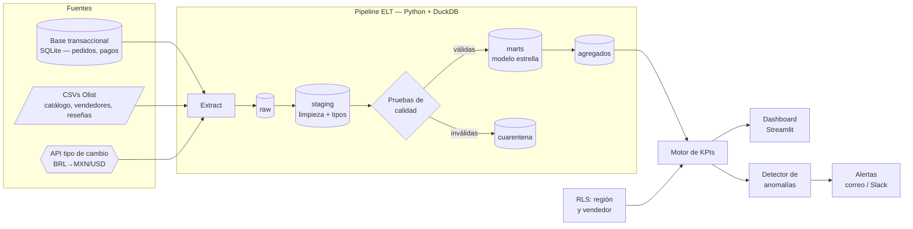
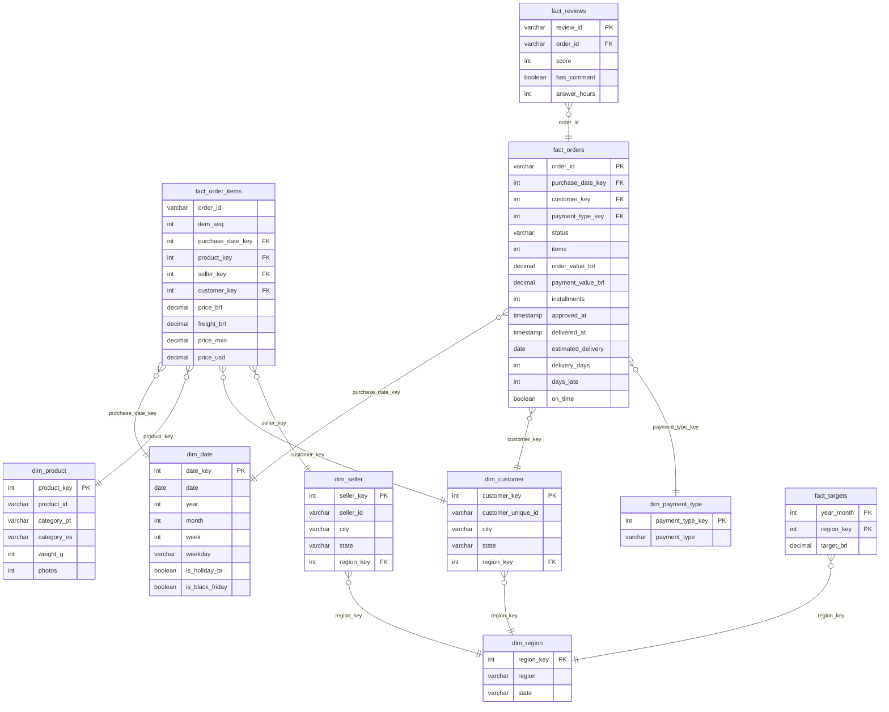

# Fase 0 — Diseño: BI & KPI Analytics (datos reales de Olist)

> **Estado:** borrador v2 para aprobación. No hay código todavía.
> **Vacante de referencia:** Analista de QuickSuite (BI) — CDMX, remoto híbrido, $55k–62k MXN/mes.
> **Alcance:** 100 % local y gratuito. Guía para migrar a AWS/Amazon Quick Suite al final.
> **Datos:** reales y públicos — *Brazilian E-Commerce Public Dataset by Olist*.

---

## 1. Objetivo

Construir un sistema de Business Intelligence de punta a punta, **sobre datos reales de una empresa real**, que haga
cada responsabilidad de la vacante: tomar datos crudos de varias fuentes, limpiarlos, modelarlos en estrella,
calcular KPIs, mostrarlos en un dashboard interactivo, detectar anomalías y mandar alertas, con seguridad por rol.

### Vacante → solución

| Responsabilidad / requisito | Cómo lo cubre el proyecto | Módulo |
|---|---|---|
| Diseñar y mantener tableros y modelos analíticos | Dashboard de 5 páginas + modelo estrella | `dashboard/`, `sql/marts/` |
| Conectar SQL, nube, APIs y archivos planos | 3 tipos de fuente: base SQL transaccional, archivos CSV, API de tipo de cambio | `extract/` |
| Limpiar y estructurar los datos | Capa *staging*: tipado, deduplicación, traducción de categorías, normalización de ciudades | `sql/staging/` |
| Definir, validar y monitorear KPIs | KPIs declarados en `kpis.yaml` (fórmula, meta, dirección, umbrales) | `kpis/` |
| Optimizar consultas y velocidad de carga | Tablas agregadas + benchmark documentado antes/después | `sql/marts/agg_*`, `scripts/benchmark.py` |
| Alertas automáticas y análisis de anomalías | Detección robusta (mediana + MAD) + reglas vs. meta → correo/Slack | `anomalies/`, `alerts/` |
| Integridad, precisión y gobernanza | Pruebas de calidad sobre problemas **reales** del dataset, cuarentena, conciliación | `quality/` |
| Seguridad a nivel de fila (RLS) | Por región de Brasil **y por vendedor** (portal de seller); filtro en la capa de consulta | `security/` |
| Publicación de espacios de trabajo | Exportación de datasets + reglas RLS en formato compatible con Quick Suite | `docs/quicksuite.md` |
| Modelos estrella / copo de nieve, ETL/ELT | Patrón ELT: raw → staging → marts (estrella) | `sql/` |
| Capacitar a usuarios finales | Manual de usuario con capturas | `docs/user-guide.md` |
| Python (plus) | Todo el pipeline en Python + SQL | — |
| Comunicar hallazgos a no técnicos | Página "Resumen ejecutivo" con lectura en lenguaje natural de cada KPI | `dashboard/` |

---

## 2. Los datos: Olist

**Olist** es un marketplace brasileño que conecta pequeñas tiendas con grandes plataformas de e-commerce.
La empresa publicó sus datos comerciales reales (anonimizados) de **~100,000 pedidos entre 2016 y 2018**.

| Archivo | Contenido | Uso en el proyecto |
|---|---|---|
| `olist_orders_dataset` | Pedido, estatus, fechas de compra, aprobación, envío, **entrega real** y **entrega estimada** | Hechos de pedidos y entregas |
| `olist_order_items_dataset` | Líneas: producto, vendedor, **precio** y **flete** | Hechos de ventas |
| `olist_order_payments_dataset` | Método de pago, mensualidades, monto | Mezcla de pagos, conciliación |
| `olist_order_reviews_dataset` | Calificación 1–5 y comentarios | Satisfacción del cliente |
| `olist_customers_dataset` | Cliente (único y por pedido), ciudad, estado | Dimensión cliente |
| `olist_sellers_dataset` | Vendedor, ciudad, estado | Dimensión vendedor + RLS |
| `olist_products_dataset` | Categoría, peso, medidas, fotos | Dimensión producto |
| `product_category_name_translation` | Categoría portugués → inglés | Traducción (agregamos español) |
| `olist_geolocation_dataset` | Código postal → lat/long | Mapas |

**Licencia:** CC BY-NC-SA 4.0 — uso no comercial con atribución. Los datos **no se suben al repo**: un comando los
descarga (Kaggle API) o los toma de un ZIP local. Las pruebas usan un *fixture* pequeño hecho a mano con el mismo esquema.

### Qué no existe en los datos (y cómo lo resolvemos, declarado en el README)

| Falta | Solución |
|---|---|
| Metas de venta | Meta derivada: mismo mes del año anterior × (1 + crecimiento objetivo), configurable en `targets.yaml` |
| Costo del producto (margen) | Se sustituye por **flete como % de la venta** y **ventas netas de cancelaciones** |
| Moneda local | Conversión real BRL → MXN y USD con el tipo de cambio histórico de cada día |

---

## 3. Arquitectura



**Cómo se simulan las 3 fuentes con datos reales:** las tablas de pedidos y pagos se cargan primero en una base
SQLite que hace de "sistema transaccional" y se extraen con SQL (incremental por fecha); catálogo, vendedores y
reseñas se leen como archivos planos; el tipo de cambio viene de una API pública (Frankfurter / BCE). Si no hay
internet, se usa un respaldo local versionado.

**Decisiones técnicas**

| Decisión | Elección | Por qué |
|---|---|---|
| Almacén analítico | **DuckDB** (un archivo) | SQL analítico rápido, cero servidor. El mismo SQL corre en Athena/Redshift casi sin cambios |
| Transformaciones | **SQL puro** en archivos versionados | Igual que se trabaja con dbt/Athena; fácil de revisar |
| Dashboard | **Streamlit + Plotly** | Interactivo, se corre con un comando, ideal para capturas |
| Configuración | YAML (`kpis.yaml`, `users.yaml`, `targets.yaml`, `sources.yaml`) | Agregar un KPI no requiere tocar código |
| Pruebas | **pytest** + **Playwright** + GitHub Actions | Unitarias, de datos, de integración y de navegador |

---

## 4. Modelo de datos (estrella)



**Granularidad:** `fact_order_items` = una línea de pedido; `fact_orders` = un pedido; `fact_reviews` = una reseña;
`fact_targets` = región × mes.

**Agregados para rendimiento:** `agg_sales_daily` (día × región × categoría) y `agg_delivery_weekly`. El dashboard
lee de aquí; el benchmark compara tiempos contra consultar los hechos directamente.

---

## 5. KPIs

Definidos en `config/kpis.yaml`. Cada KPI tiene: fórmula SQL, unidad, meta, dirección y umbrales de alerta.
Moneda seleccionable en el dashboard: **BRL / MXN / USD**.

| Grupo | KPI | Fórmula | Alerta si… |
|---|---|---|---|
| Ventas | **Ventas (GMV)** | Σ precio de pedidos no cancelados | Anomalía o < 90 % de la meta prorrateada |
| Ventas | **Cumplimiento de meta** | Ventas ÷ meta del periodo | < 90 % |
| Ventas | **Pedidos** | # pedidos | Anomalía |
| Ventas | **Ticket promedio** | Ventas ÷ pedidos | Anomalía |
| Clientes | **Clientes únicos** | # `customer_unique_id` | Caída > 15 % vs. periodo anterior |
| Clientes | **Tasa de recompra** | Clientes con ≥ 2 pedidos ÷ clientes | Informativo |
| Operación | **Entregas a tiempo (OTD)** | Entregados ≤ fecha estimada ÷ entregados | < 90 % |
| Operación | **Días de entrega** | Promedio compra → entrega | Anomalía |
| Operación | **Flete % de venta** | Σ flete ÷ Σ precio | > 20 % |
| Operación | **Tasa de cancelación** | Cancelados ÷ pedidos | > 2 % |
| Satisfacción | **Calificación promedio** | Promedio de reseñas (1–5) | < 4.0 |
| Satisfacción | **% reseñas negativas** | Reseñas 1–2 ÷ reseñas | > 15 % o anomalía |
| Marketplace | **Vendedores activos** | # vendedores con venta en el periodo | Informativo |

Todos se pueden cortar por fecha, región, estado, categoría, vendedor y método de pago.

**Bonus de análisis:** relación entre retraso de entrega y calificación (¿cuánto baja la calificación por cada día de retraso?).

---

## 6. Detección de anomalías y alertas

1. Para cada KPI × región se arma una serie diaria (o semanal para KPIs de bajo volumen).
2. **Método robusto:** puntuación z con mediana móvil y MAD en ventana de 28 días, ajustada por día de la semana.
   Marca anomalía si |z| > 3.5. Resiste valores extremos, a diferencia de media y desviación estándar.
3. **Reglas de negocio:** además compara contra los umbrales de `kpis.yaml`.
4. Cada alerta se guarda en `alerts_log`: fecha, KPI, región, valor, esperado, severidad y mensaje.
5. **Envío:** correo (SMTP) y Slack (webhook). En **modo demo** escribe los correos en `outbox/`.
6. **Modo "replay":** `bi replay --from 2017-01-01` recorre la historia día por día como si fuera en vivo, para
   demostrar qué alertas habrían llegado y cuándo.

**Eventos reales que esperamos que el detector encuentre** (se confirman con los datos en la Fase 1):

| Evento | Fecha | KPI esperado |
|---|---|---|
| Black Friday | 24-nov-2017 | Pico de pedidos y ventas |
| Huelga nacional de transportistas en Brasil | ~21–31 may-2018 | Caída de OTD, aumento de días de entrega y de reseñas negativas |
| Fin abrupto de los datos | sep–oct 2018 | Debe marcarse como **periodo incompleto** (calidad), no como "caída de ventas" |

**Criterio de éxito:** detecta los dos primeros eventos, clasifica bien el tercero y genera pocas falsas alarmas
(objetivo: ≤ 1 por KPI por mes). Queda como prueba automática.

---

## 6.1 Contingencias y eventos

Dos niveles: que **el sistema** siga funcionando ante lo inesperado y que **el negocio** reaccione a tiempo.

### A. Calendario de eventos (`config/events.yaml`)

| Tipo | Ejemplo | Qué hace el sistema |
|---|---|---|
| **Planeado** | Black Friday, Navidad, Carnaval, campañas | Se registra con anticipación: la meta se ajusta, el detector **no** lo marca como anomalía y el dashboard lo anota en las gráficas |
| **No planeado** | Huelga de transportistas, falla del sitio | Se detecta, se registra (manual o al confirmar una alerta) y queda anotado: sus días se **excluyen de la línea base** para no "enseñarle" al detector que lo anormal es normal |

### B. Alerta temprana (antes de que el daño sea visible)

Un retraso de entrega solo se ve cuando el pedido **no llega**, días después. Por eso se vigilan **indicadores
adelantados**:

| Indicador adelantado | Anticipa |
|---|---|
| Horas de aprobación → envío al transportista | Retrasos de entrega |
| % pedidos que pasaron su fecha límite de envío sin salir | Incumplimiento de OTD |
| % pedidos abiertos con fecha estimada vencida | Reseñas negativas |
| Pedidos por hora vs. lo esperado | Caídas del sitio o picos de demanda |

### C. Playbooks (qué hacer cuando suena una alerta)

Cada regla de alerta tiene un responsable y acciones sugeridas, por ejemplo:
*"OTD cae < 85 % en una región → Logística: revisar transportistas de la región; Atención a clientes: avisar
proactivamente a pedidos en riesgo (lista adjunta); Comercial: pausar promociones con envío prometido a esa región."*
La alerta incluye la **lista de pedidos en riesgo**, no solo el número.

### D. Análisis de impacto (después del evento)

Para cada evento: ventas, OTD y calificación **reales vs. esperados** (línea base sin el evento) → "la huelga costó
X pedidos tardíos y bajó la calificación Y puntos". Sirve para planear el siguiente.

### E. Resiliencia del pipeline (que el sistema no se caiga)

| Riesgo | Medida |
|---|---|
| La fuente (API, base) no responde | Reintentos con espera creciente; respaldo en caché (ya implementado para tipo de cambio) |
| Datos incompletos o tardíos | Prueba de frescura y completitud: el periodo se marca "incompleto" y no dispara alertas de caída |
| Pico de volumen (Black Friday ×5) | Carga incremental por marca de agua; prueba de carga con volumen ×5 |
| Una carga falla a la mitad | Cargas idempotentes: se puede repetir sin duplicar; el dashboard sigue mostrando la última carga buena |
| Datos corruptos | Pruebas de calidad + cuarentena (sección 7) |
| Tormenta de alertas | Agrupación y silencio: una alerta por evento, no 50 |

---

## 7. Calidad y gobernanza de datos

Con datos reales, los problemas de calidad **no se inventan: se encuentran**. Esperamos (y se confirma al cargar):

| Prueba | Problema real que esperamos encontrar |
|---|---|
| Consistencia de estatus | Pedidos "entregados" sin fecha de entrega |
| Orden de fechas | Entrega antes que la compra o aprobación |
| Valores faltantes | Productos sin categoría o sin medidas |
| Cobertura de traducción | Categorías sin traducción en la tabla oficial |
| Unicidad | Reseñas con `review_id` repetido; códigos postales duplicados en geolocalización |
| Conciliación | Σ pagos ≠ Σ (precio + flete) en algunos pedidos |
| Normalización | Mismas ciudades escritas distinto (acentos, mayúsculas) |
| Frescura / completitud | Meses finales con muy pocos pedidos |
| Conciliación del pipeline | Σ ventas en marts = Σ ventas en raw válidas (sin pérdida ni duplicados) |

- Las filas que fallan van a **cuarentena** con el motivo; no se pierden ni contaminan los KPIs.
- Se genera un **reporte de calidad** con el conteo de cada problema; aparece en el dashboard.

---

## 8. Seguridad a nivel de fila (RLS)

`config/users.yaml` (usuarios de demo, sin contraseñas reales):

| Usuario | Rol | Ve |
|---|---|---|
| `direccion` | Director | Todo |
| `gerente.sudeste` | Gerente regional | Solo pedidos de clientes del Sudeste (SP, RJ, MG, ES) |
| `gerente.nordeste` | Gerente regional | Solo Nordeste |
| `analista` | Analista | Todo, sin datos a nivel cliente individual |
| `vendedor.<id>` | Vendedor (portal de seller) | Solo sus propios pedidos, ventas y reseñas |

- El filtro se aplica en la **capa de consultas** (`secure_query(user, …)`), no solo en la interfaz.
- Pruebas automáticas: un gerente nunca recibe filas de otra región; un vendedor nunca ve datos de otro vendedor.
- Se exporta `rls_rules.csv` en el formato de *dataset de permisos* que usa Quick Suite/QuickSight.

---

## 9. Dashboard (boceto)

Selector de usuario arriba (demo de RLS) + filtros globales: fechas, región, estado, categoría, moneda.
*(Los números del boceto son ilustrativos.)*

**Página 1 — Resumen ejecutivo**
```
┌──────────────────────────────────────────────────────────────────────┐
│ Usuario: [direccion ▼]  Fechas: [2017-01 → 2018-08]  Región ▼  MXN ▼  │
├──────────────┬──────────────┬──────────────┬──────────────┬──────────┤
│ Ventas       │ Cumpl. meta  │ Pedidos      │ OTD          │ Calif.   │
│ $ —— M       │ —— %   ▼     │ ——           │ —— %   ▼     │ —— ★     │
│ vs. año ant. │ meta 100 %   │ ticket $——   │ meta 90 %    │ meta 4.0 │
├──────────────┴──────────────┴──────────────┴──────────────┴──────────┤
│  Ventas mensuales vs. meta (línea)          ▲ Black Friday 2017       │
├───────────────────────────────────┬──────────────────────────────────┤
│ Ventas por región (barras)        │ Alertas (ejemplo)                 │
│ ███████████ Sudeste               │ 🔴 OTD Nordeste cae a ——%         │
│ ████ Sul                          │ 🟠 Reseñas negativas suben ——%    │
│ ███ Nordeste                      │ 🟡 Días de entrega +—— vs normal  │
│ ██ Centro-Oeste  █ Norte          │                                   │
├───────────────────────────────────┴──────────────────────────────────┤
│ 📝 Lectura: "Las ventas crecen ——% anual impulsadas por el Sudeste.   │
│ En mayo 2018 la puntualidad cayó por la huelga de transportistas…"    │
└──────────────────────────────────────────────────────────────────────┘
```

**Página 2 — Ventas:** tendencia, desglose región → estado, categorías, top vendedores, métodos de pago y mensualidades,
mapa por estado.

**Página 3 — Operación y satisfacción:** OTD y días de entrega por región, flete %, cancelaciones, calificación,
y la gráfica **retraso vs. calificación**.

**Página 4 — Alertas y anomalías:** tabla de alertas con filtros y gráfica de cada serie con los puntos anómalos y la
banda esperada.

**Página 5 — Calidad de datos:** resultado de cada prueba (✅/❌), filas en cuarentena y motivo, completitud por mes.

**Idioma:** interfaz en **español** (categorías traducidas al español). README bilingüe.

---

## 10. Estructura del proyecto

```
01-bi-kpi-analytics/
├── README.md                  # Bilingüe: problema, demo, capturas, vacante → solución
├── pyproject.toml
├── Makefile                   # make data | make demo | make test | make dashboard
├── config/
│   ├── kpis.yaml
│   ├── users.yaml
│   ├── targets.yaml
│   └── sources.yaml
├── sql/
│   ├── staging/               # limpieza y tipado
│   └── marts/                 # dimensiones, hechos, agregados
├── src/bi_kpi/
│   ├── download/              # Kaggle API o ZIP local
│   ├── extract/               # SQLite (SQL), CSV, API
│   ├── transform/             # ejecuta los SQL en orden
│   ├── quality/               # pruebas de calidad + cuarentena
│   ├── kpis/                  # motor de KPIs desde YAML
│   ├── anomalies/             # detector mediana + MAD
│   ├── alerts/                # correo, Slack, outbox
│   ├── security/              # RLS
│   ├── dashboard/             # app Streamlit
│   └── cli.py                 # bi download | bi load | bi run-daily | bi replay | bi dashboard
├── scripts/benchmark.py
├── tests/
│   ├── fixtures/              # mini-dataset hecho a mano con el esquema de Olist
│   ├── unit/
│   ├── data_quality/
│   ├── integration/
│   └── e2e/                   # Playwright
├── docs/
│   ├── design.md              # este documento
│   ├── user-guide.md          # capacitación a usuarios finales
│   ├── quicksuite.md          # guía de migración a AWS
│   └── screenshots/
└── data/                      # descargado, ignorado por git
```

**Para correrlo:** `make data` (descarga Olist) → `make demo` (carga, valida, calcula KPIs, detecta anomalías y abre el dashboard).

---

## 11. Plan de pruebas

| Nivel | Qué verifica | Ejemplo |
|---|---|---|
| Unitarias | Cada función y cada KPI con datos conocidos | OTD de 4 pedidos inventados (3 a tiempo) = 75.00 % exacto |
| Calidad de datos | El pipeline detecta y aísla lo inválido | Pedido "entregado" sin fecha termina en cuarentena |
| Integración | Pipeline completo con el *fixture* | Σ ventas raw válidas = Σ ventas marts |
| Datos reales | Pipeline completo con Olist (local, no en CI) | Se detectan Black Friday y la huelga de mayo 2018 |
| Seguridad | RLS sin fugas | `gerente.sudeste` → 0 filas de otras regiones |
| E2E (navegador) | El dashboard carga y responde | Cambiar región actualiza las tarjetas; capturas automáticas |
| Rendimiento | Consultas del dashboard rápidas | Página principal < 1 s con agregados |
| CI | Todo lo que no requiere el dataset completo, en cada push | GitHub Actions + insignia ✅ en el README |

---

## 12. Plan de trabajo (Fase 1 en adelante)

| Paso | Entregable | Revisión |
|---|---|---|
| 1 | Descarga + extracción de 3 fuentes + staging + modelo estrella | Pruebas de integración |
| 2 | Pruebas de calidad + cuarentena + reporte | Pruebas de datos |
| 3 | Motor de KPIs + metas + RLS | Pruebas unitarias y de seguridad |
| 4 | Dashboard (5 páginas) | E2E + capturas → **revisión tuya** |
| 5 | Anomalías + alertas + `run-daily` + `replay` | Debe detectar los eventos reales |
| 5b | Calendario de eventos, alerta temprana, playbooks, análisis de impacto, pruebas de resiliencia | La huelga se anticipa con indicadores adelantados |
| 6 | Benchmark, CI, user guide, guía Quick Suite, README final | **Revisión tuya** → Pull Request |

---

## 13. Fuera de alcance (por ahora)

- Cuenta real de AWS / Quick Suite (se documenta la migración; opcional al final con la prueba gratuita).
- Autenticación real con contraseñas (el selector de usuario es para demostrar RLS).
- Análisis de texto de las reseñas (están en portugués; posible extensión futura).

## 14. Atribución

Datos: *Brazilian E-Commerce Public Dataset by Olist*, publicado en Kaggle bajo licencia CC BY-NC-SA 4.0.
Este proyecto no está afiliado a Olist.
