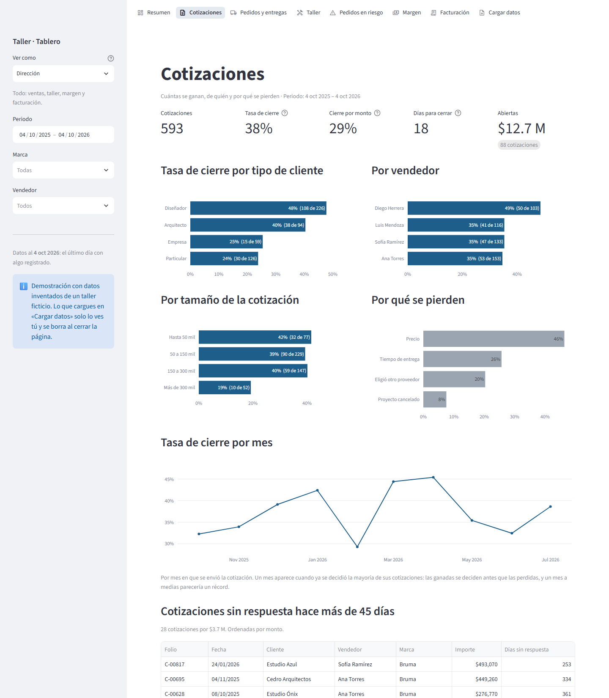
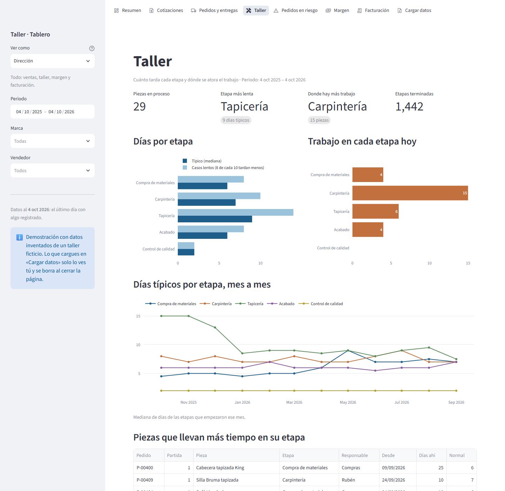
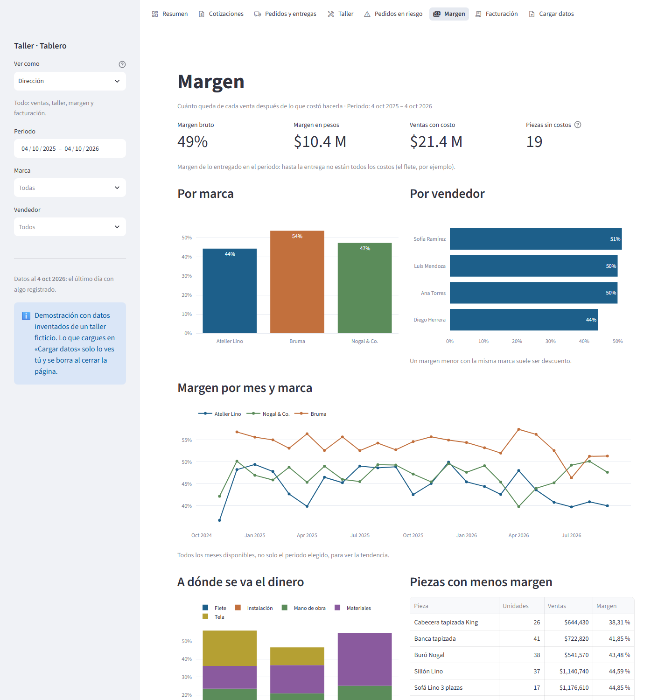
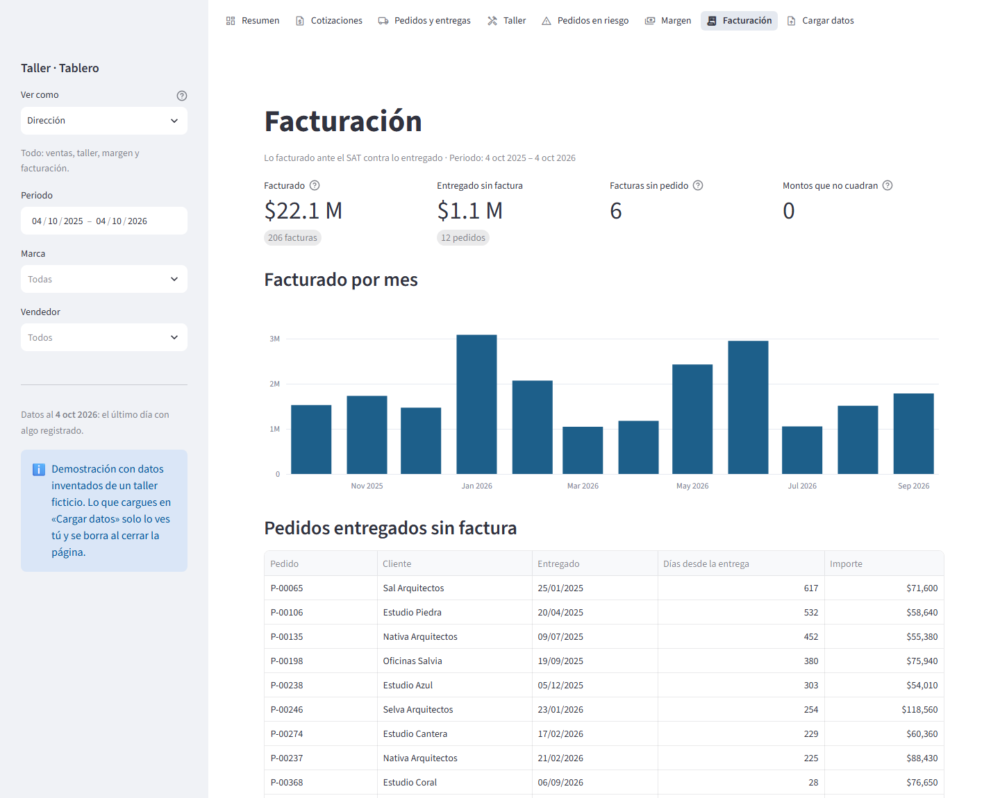

# 02 · Made-to-Order BI — a web dashboard for a custom furniture workshop

[](https://github.com/nitoramber-svg/Portfolio-automations-of-Software/actions/workflows/made-to-order-bi.yml)

A web app a small furniture workshop can use **without anyone technical in the middle**: people
fill in four Excel templates (or paste what their system exports), drop in the SAT's invoice
XML, and every area gets its own board — close rate, shop-floor times, margin by piece and brand,
billing, and **the orders that are going to arrive late, with the reason for each**.

Built for a real made-to-order furniture company in Mexico. This repository runs on a
**made-up workshop** (brands, pieces, clients and sellers are invented); the real data never
leaves the company.

*Tablero web para un taller de muebles a la medida: plantillas de Excel y facturas del SAT de
entrada; tasa de cierre, tiempos del taller, margen y pedidos que van a llegar tarde de salida.
La guía de uso está en español: [docs/guia.md](docs/guia.md).*


## What it does

| The workshop needs | What the app does | Where |
|---|---|---|
| Get data in without IT | Four Excel templates with drop-down lists and an instructions sheet; headers matched ignoring accents and case; Mexican formats (`$12,500.00`, `15/03/2026`, Excel serial dates); **every rejected row reported with its Excel row number** | `schema.py`, `ingest.py` |
| Invoices | Reads CFDI 3.3 and 4.0 XML, loose or in the SAT's bulk-download ZIP; converts foreign currency at the invoice's rate; credit notes subtract; payment receipts skipped and reported | `cfdi.py` |
| Close rate | By count and by money (big quotes close less); by client type, seller, size; why quotes are lost; open quotes going cold | `metrics.py` |
| Delivery and the shop floor | On-time by order (late if its last piece is); typical and slow time per stage; work sitting in each stage today | `metrics.py` |
| Margin by piece and brand | Costs per piece or per order (spread by price); pieces without costs reported as missing, **never as 100 % margin** | `metrics.py` |
| Alert on late orders | For each open piece: the stages it still needs, at the shop's recent pace → estimated date vs promise → *overdue / running late / tight / on time*, with the reason | `risk.py` |
| Each area sees its own | Sales never sees costs; the shop never sees prices; a seller sees only their clients — applied to the data before any page runs | `roles.py` |

## What the demo data hides — and the app finds

The generator plants the kind of stories a real workshop has; the tests check the dashboard
finds each one with the same functions the pages use:

- **Upholstery is the bottleneck every year-end**: 15 days typical in October–December against
  9 the rest of the year, and on-time delivery falls from 77 % to 56 %.
- **Imported fabric got dearer**: Atelier Lino's margin fell from 46 % to 42 % in six months, and
  the summary says why — fabric went from 17 % to 22 % of the price.
- **The seller who closes most earns least**: 52 % close rate against ~34 % for the others, by
  discounting — and 45 % margin against 51 %.
- **Designers close 45 % of quotes; private clients, 24 %**; quotes over $300k close 26 %.
- Delivered orders never invoiced, invoices with no order, and typing mistakes in the files.

## The late-order estimate, checked against history

An estimate nobody has checked is a guess. `risk.backtest` re-runs it on the 15th of each of the
last 12 months **using only what was known that day**, then compares with what happened
(365 pieces on the demo):

| | |
|---|---|
| Of the pieces it flagged as *running late*, how many were late | **72 %** (guessing: 26 %) |
| Of the pieces that were late, how many it flagged in advance | 41 % |
| Error of the estimated delivery date (median) | 2 days |

The page shows this check to the user, in Spanish, under "¿Cómo se calcula la fecha estimada?".

## Where measuring changed the design

- **Close rate by month showed a record in the last month** (64 % in a year running at 38 %):
  wins are decided faster than losses, so a half-decided month shows only the quick wins. A month
  now enters the trend only once most of its quotes are decided.
- **"Today" is the last day anything was recorded**, not the calendar: a workshop that sends its
  files every Monday would otherwise see every open piece turn overdue by Friday.
- **Margin is measured on delivered orders**: freight and installation are charged at delivery,
  so orders in progress always look more profitable than they are.
- **Recent pace, not all-time pace**: stage times use the last 120 days, so a fabric shortage
  shows up in the estimates while it lasts.

## Screens

| Quotes: close rate by client, seller and size | Shop floor: time per stage and work in progress |
|---|---|
|  |  |
| **Orders at risk, with the reason for each** | **Margin by brand, seller and month** |
|  |  |
| **Billing against deliveries (SAT XML)** | **Upload: every mistake with its row** |
|  |  |

## Run it

```bash
pip install -e ".[dev]"
mto app                 # http://localhost:8501 — the demo, generated up to today
mto sample --out demo   # the demo as files: four workbooks and the SAT ZIP
mto templates           # the four blank templates
mto check demo          # validate files the way the upload page does
pytest                  # 83 tests
python scripts/screenshots.py   # regenerate the screenshots (demo pinned to 4 Oct 2026)
```

`streamlit_app.py` is the entry point for Streamlit Community Cloud. With `MTO_DATA_DIR` set to a
folder of files, the app reads them instead of the demo. A link with `?ver=taller` (or `ventas`,
`administracion`…) opens the app in that area's view.

## Tests

83 tests: the templates (each mistake on its Excel row, Mexican formats, CSV in Latin-1), invoices
(both CFDI versions, ZIPs, currencies, refused files), every metric on hand-made tables, the
late-order estimate (routes, stuck stages, the backtest as an acceptance test), who sees what
(the shop never receives a price column), the demo's stories, and every page for every role,
including an upload with errors applied end to end.

## Next

Real use needs persistent storage and a login per person (the role selector stands in for it in
the demo), and a host the company agrees to: decisions for the workshop, not code.

Python · pandas · Streamlit · Plotly · openpyxl · CFDI XML · pytest · GitHub Actions
