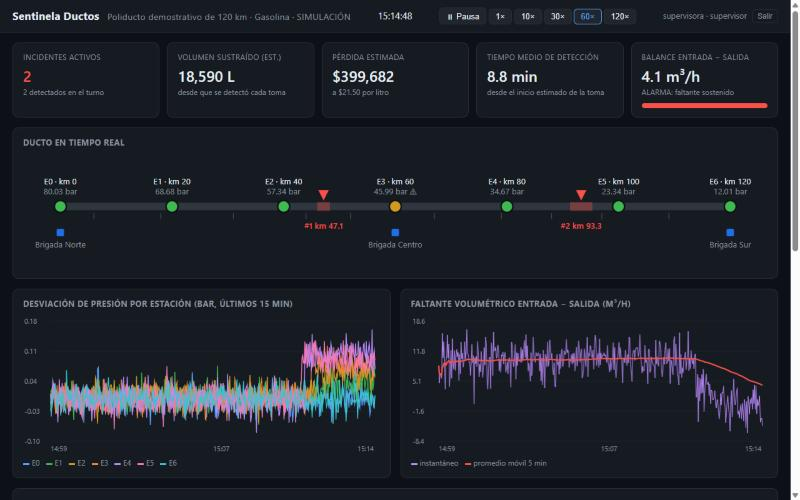
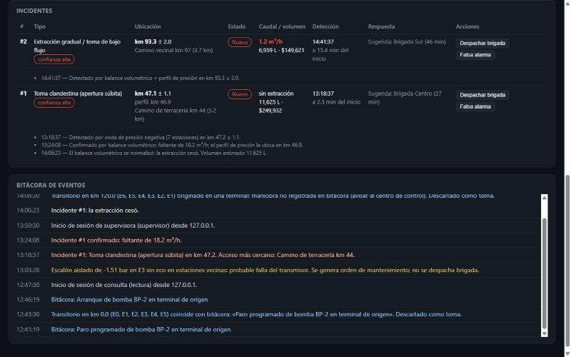
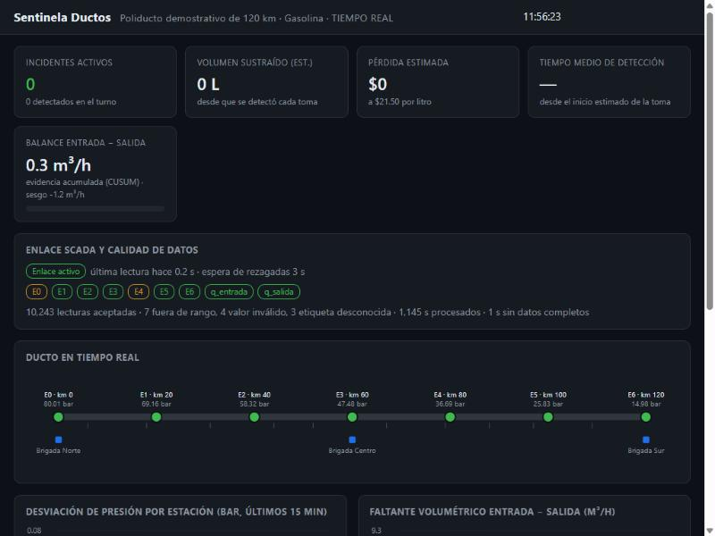

# 03 · Sentinela Ductos — real-time detection of illegal fuel taps on pipelines

[](https://github.com/nitoramber-svg/Portfolio-automations-of-Software/actions/workflows/pipeline-theft-detection.yml)

Pemex, Mexico's state oil company, lost **MXN 23.5 billion to fuel theft in 2025**. In early 2026 thieves drilled **one illegal tap every 51 minutes**. The tool that finds taps from inside the pipe, the instrumented pig, takes **about 30 days** to report. By then the tap has been milked and abandoned.

Sentinela reads data a SCADA system already produces: pressure at each station and flow at both ends. Within minutes it says:
- **there is a tap**;
- **at km 47.1 ± 1.1**;
- the nearest access road is the dirt road at km 44;
- the closest brigade is 27 min away;
- **18 m³/h are being stolen** right now.

It also tells taps apart from what looks like them: pump starts and stops, valve operations and failing pressure transmitters.

*Detecta y ubica tomas clandestinas en ductos en minutos, usando los datos de presión y caudal que el SCADA ya tiene. Distingue tomas de maniobras y fallas de sensor, y convierte cada alarma en un incidente con brigada, acceso y litros perdidos. El análisis completo del problema está en español: [docs/analisis.md](docs/analisis.md); la guía de despliegue en [despliegue/README.md](despliegue/README.md).*

> Runs on a **simulated 120 km pipeline** with a simplified hydraulic model. No real Pemex data is used. The thresholds must be calibrated on each real pipeline (see *Honest limits*).



## What it does

| The control room needs | What Sentinela does | Where |
|---|---|---|
| Know there is a tap, fast | **Negative pressure wave**: drilling a pressurised pipe sends a pressure drop both ways at ~1.1 km/s. Arrival times at each station, interpolated below one second and weighted by signal strength, triangulate the km | `deteccion.py` |
| Confirm it and measure it | **Volumetric balance + CUSUM**: inflow minus outflow, with the meters' bias learnt on start-up. Gives the stolen flow and a running litre and peso counter | `deteccion.py`, `monitor.py` |
| Catch slow-opening taps | Organised gangs open the valve slowly so no wave forms. A sustained theft bends the steady pressure profile into a triangle with its peak at the tap; fitting it gives the km. Near the terminals, where the shape alone is ambiguous, the flow measured by the balance pins it | `deteccion.py` |
| Not cry wolf | One station alone → **transmitter fault** (maintenance ticket, no brigade). Wave from a terminal, or matching the operations log → **maneuver**. An imbalance that does not persist past the line's refill time → **re-packing** | `monitor.py` |
| Turn an alarm into action | Incident with km ± uncertainty, nearest access road, suggested brigade and ETA, live litres and pesos. Workflow: dispatch → on site → sealed / false alarm, each step stamped with who did it | `incidentes.py` |
| Live SCADA data, as it really arrives | HTTP ingestion and an **OPC-UA** client. Validates, reorders late readings, fills short gaps and suspends detection on long ones, so a gap is never read as a tap | `ingesta.py`, `fuente_opcua.py` |
| Run 24/7 | Users with roles, HTTPS, hot backups, restart without losing the shift, health endpoint, and a **watchdog** that pages the on-call team on Telegram or a webhook | `auth.py`, `servidor.py`, `almacen.py`, `vigia.py` |

## Validation

**Monte Carlo campaign** (`sentinela campana`): 160 simulated taps with random flow, location and opening speed, plus 2 days of normal operation with 34 pump and valve maneuvers, half of them **missing from the operations log**.

| Tap flow | Abrupt opening | Slow opening (5–30 min) | Location error, p90 |
|---|---|---|---|
| 2–3 m³/h | 0 % | 0 % | — |
| 5 m³/h | 100 % | 100 % | 1.8 km |
| 8 m³/h | 100 % | 100 % | 2.2 km |
| 12–40 m³/h | 100 % | 100 % | 0.25–0.65 km |

- **0 false alarms** in 2 days of normal operation.
- **0 spurious or duplicate incidents.**
- Abrupt taps are found in **~2.3 min**. Slow ones take 15–50 min, depending on their flow.
- Sensitivity sits between **3 and 5 m³/h** (≈0.5 % of nominal flow).

**The campaign and the OPC-UA test found five real defects, now fixed with regression tests:**
1. Unlogged pump starts were reported as theft.
2. Pressure ramps from slow taps were mistaken for waves.
3. Taps near the terminals were placed up to 13 km off.
4. Small taps were reported twice.
5. A dashboard re-render moved buttons from under the operator's cursor.

**With real data**, `sentinela evaluar historico.csv --tomas confirmadas.csv` reports:
- detection rate;
- false alarms per day;
- location error;
- detection time.

These are the metrics used to assess leak detection systems under API RP 1130 / 1175. Incidents with no known tap are listed for field checks: they may be false alarms, or taps nobody had found.

## Live data, security and operations

| Every step leaves a trace: who logged in, who dispatched, who closed | SCADA link health and data quality |
|---|---|
|  |  |

**Tested end to end:**
- Over HTTP with 2 % lost, out-of-order and junk readings.
- Over **encrypted OPC-UA** (Basic256Sha256, SignAndEncrypt) against a test SCADA server. A client without encryption is refused.

**Security:**
- PBKDF2 password hashes.
- Lock-out after failed logins.
- HttpOnly + SameSite=Strict session cookies.
- Role checks on the server: *read-only < operator < supervisor < admin*.
- JSON-only API as CSRF defence.
- Security headers.
- Optional TLS.
- A separate machine token that can send readings and read, but never act.

The server **refuses to listen on the network** without users, HTTPS and a token. Sentinela only reads from the SCADA and never writes to it, which suits an IEC 62443 zone design. The [deployment guide](despliegue/README.md) covers network zones, systemd units with hardening, backups and restore, active–passive redundancy and the on-call watchdog.

## Run it

Needs Python 3.10+. The core has **no dependencies**.

```bash
pip install -e ".[dev]"            # add ,opcua for the OPC-UA client
sentinela demo                     # live dashboard on a simulated 3-hour shift
sentinela campana                  # Monte Carlo validation
sentinela simular --salida lecturas.csv && sentinela analizar lecturas.csv
pytest                             # 37 tests
```

Live mode with logins, HTTPS and a test emitter:

```bash
sentinela usuarios --archivo usuarios.json agregar ana --rol supervisor
sentinela servidor --usuarios usuarios.json --token TOKEN --sin-verificar-reloj
sentinela emisor --token TOKEN --velocidad 25 --perdida 0.02 --desorden --basura
sentinela vigia --url http://127.0.0.1:8765 --token TOKEN --webhook https://...
```

Encrypted OPC-UA against the test SCADA:

```bash
python herramientas/servidor_opcua_prueba.py --velocidad 20 --seguro certs/
sentinela servidor --sin-verificar-reloj --opcua certs/mapa_seguro.json
```

## Honest limits

- **Not validated on a real pipeline.** The simulator uses a linearised hydraulic model. A real line has branches, several pump stations, product batches and slack flow. The next step is a **shadow-mode pilot**, plus controlled withdrawals at known km and flow.
- Location accuracy depends on station spacing and **clock sync**: 1 s of skew is about 550 m of error, so stations need GPS/NTP.
- Taps under ~3 m³/h fall below what the balance can see. They call for acoustic fibre (DAS) or patrols.
- Redundancy is active–passive with a manual or keepalived switch-over. Several pipelines would need PostgreSQL with replication.

## Layout

```
sentinela/
  simulador.py    hydraulic model: profile, Joukowsky wave, maneuvers, sensor faults
  deteccion.py    wave detector, balance + CUSUM, pressure-profile fit
  monitor.py      fusion: tap vs maneuver vs sensor fault; incident lifecycle hooks
  ingesta.py      live readings → validated, reordered, gap-aware 1 Hz samples
  fuente_opcua.py OPC-UA subscription client (read-only, optional encryption)
  incidentes.py   incidents, brigades, ETA, workflow, audit
  auth.py         users, roles, sessions, lock-out
  servidor.py     HTTP API + dashboard, TLS, security headers, health
  almacen.py      SQLite, hot backups with rotation, restart continuity
  vigia.py        watchdog: pages on downtime and new incidents
  evaluacion.py   API-1130-style metrics and Monte Carlo campaign
  web/index.html  dashboard (vanilla JS, no build step)
herramientas/     test OPC-UA SCADA server (plain or encrypted)
despliegue/       systemd units and the 24/7 operations guide (Spanish)
docs/analisis.md  problem analysis, sources and business path (Spanish)
```

Python (standard library) · SQLite · OPC-UA (asyncua) · vanilla JS · unittest / pytest (37 tests) · GitHub Actions
