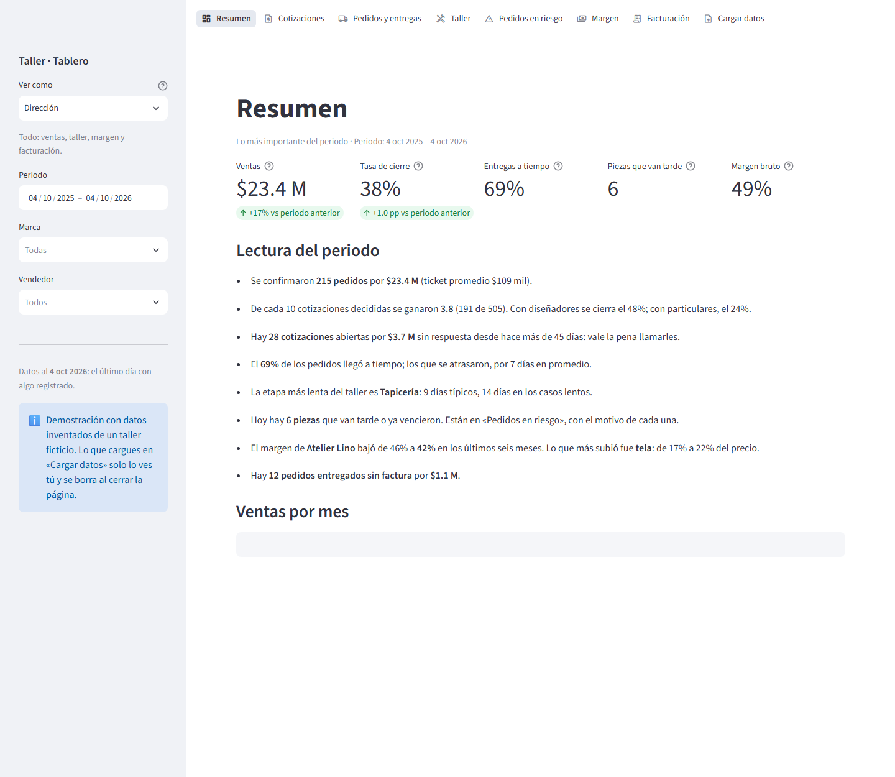
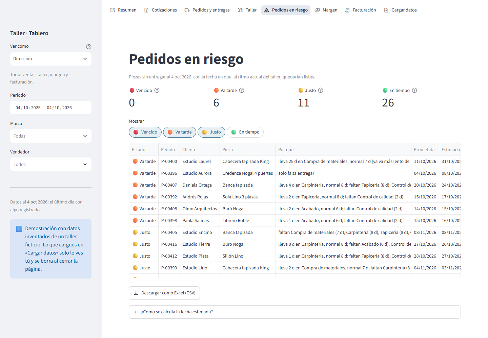
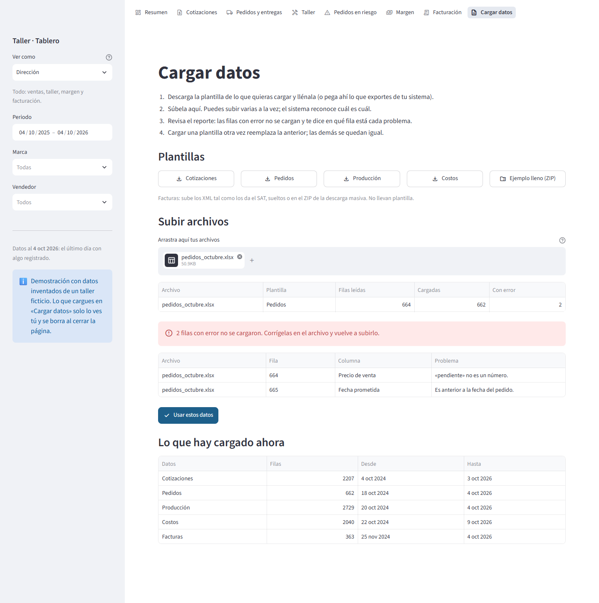

# Portfolio — Automations of Software

Software built to automate the real requirements of job postings.
Each folder is an independent project: it takes a role's day-to-day tasks and turns the repetitive parts into tooling.

*Software construido para automatizar los requisitos reales de vacantes de empleo. Cada carpeta es un proyecto independiente.*

| # | Project | Role it targets | Status |
|---|---|---|---|
| 01 | [BI & KPI Analytics](01-bi-kpi-analytics/) | BI / Data Analyst (Amazon Quick Suite, SQL, AWS) | ✅ Done |
| 02 | [Made-to-Order BI](02-made-to-order-bi/) | BI Analyst for a custom furniture manufacturer | ✅ Done |

---

## 01 · [BI & KPI Analytics](01-bi-kpi-analytics/)

An end-to-end BI system on **real data from Olist**, a Brazilian marketplace (~100k orders,
2016–2018), built requirement by requirement from a BI Analyst job posting.

**What it offers**

- **Anomaly alerts that see trouble coming.** It flagged the May 2018 national truckers' strike
  **7 days before deliveries failed** — and each alert arrives with who acts, what to do and the
  list of orders at risk.
- **A dashboard for each role.** Directors see everything; regional managers, only their region;
  sellers, only their own sales — enforced in the query layer, with leak tests.
- **Numbers you can trust.** 30 data-quality checks, a quarantine for contradictory rows, and a
  reconciliation that refuses to publish if a single cent was lost.
- **KPIs in plain language.** 13 KPIs declared in configuration, in BRL / MXN / USD, against a
  sales plan — and a written reading of what happened for non-technical readers.
- **Ready for the cloud.** One command exports Parquet, Athena tables and QuickSight row-level
  security rules; every page loads in under a second.

| Anomaly alerts, with events and orders at risk | What each event cost |
|---|---|
|  |  |
| **Operations & satisfaction** | **The same dashboard, as a regional manager** |
|  |  |

Python · SQL · DuckDB · Streamlit · Plotly · pytest (127 tests) · GitHub Actions ·
[Read more →](01-bi-kpi-analytics/)

---

## 02 · [Made-to-Order BI](02-made-to-order-bi/)

A web dashboard a small custom furniture workshop can run **without anyone technical in the
middle**: each area fills in an Excel template, administration drops in the SAT's invoice XML,
and everyone gets their own board. Built for a real furniture maker in Mexico; this repository
runs on a made-up workshop.

**What it offers**

- **Orders that will arrive late, before they do.** For each open piece: the stages it still
  needs at the shop's recent pace, an estimated date against the promise, and the reason. Checked
  against history: 72 % of the pieces it flags were late (guessing: 26 %), dates off by 2 days.
- **Excel in, no IT needed.** Templates with drop-down lists; Mexican formats understood; every
  mistake reported with its Excel row, the rest still loads.
- **SAT invoices as they come.** CFDI 3.3 and 4.0, loose or in the bulk-download ZIP: billed vs
  delivered, orders never invoiced, invoices with no order.
- **Close rate, shop-floor times and margin by piece and brand**, with a plain-language reading
  that says which margin fell and which cost explains it.
- **Each area sees its own.** Sales never sees costs; the shop never sees prices.

| Orders at risk, with the reason for each | Upload: every mistake with its row |
|---|---|
|  |  |

Python · pandas · Streamlit · Plotly · openpyxl · CFDI XML · pytest (83 tests) · GitHub Actions ·
[Read more →](02-made-to-order-bi/)

---

## Also see

- [GovIntel MX](https://github.com/nitoramber-svg/GovIntel-MX) — procurement intelligence platform over 520k+ Mexican public contracts (FastAPI, PostgreSQL, Celery, Docker).

## License

[MIT](LICENSE)
